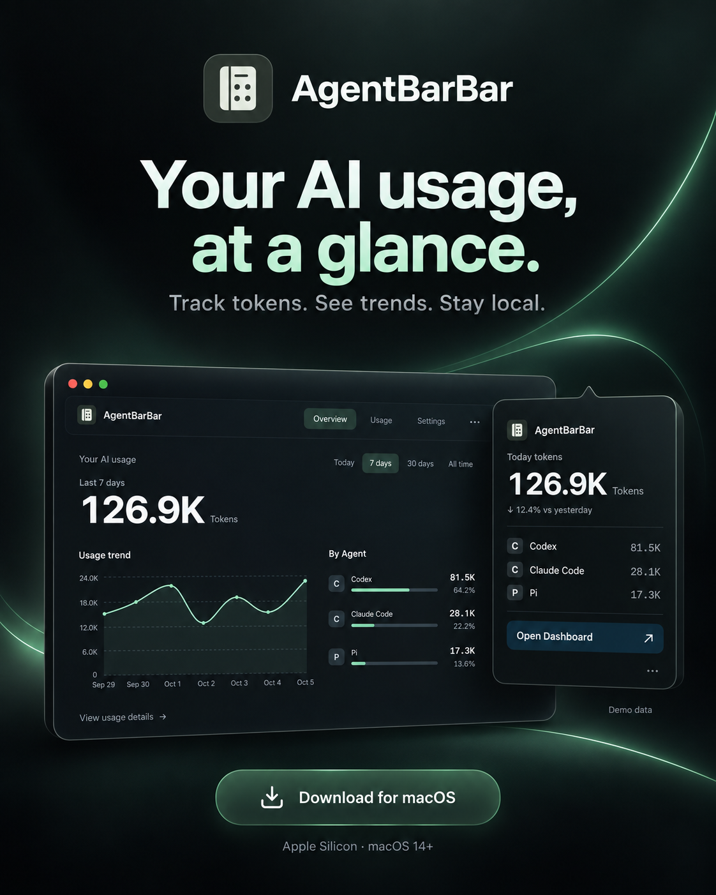
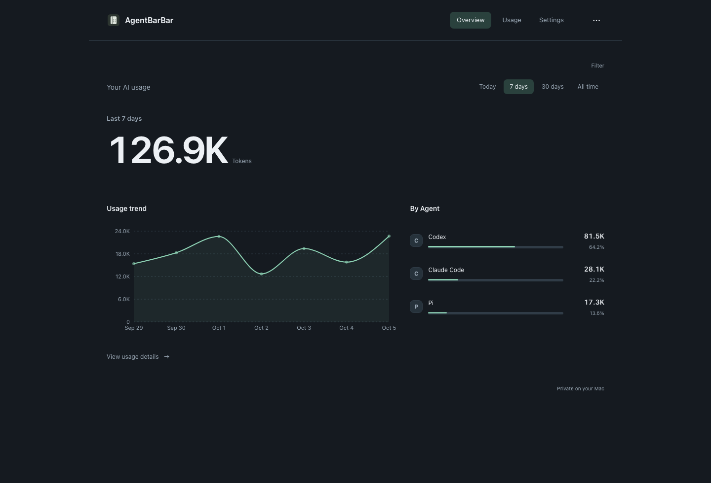
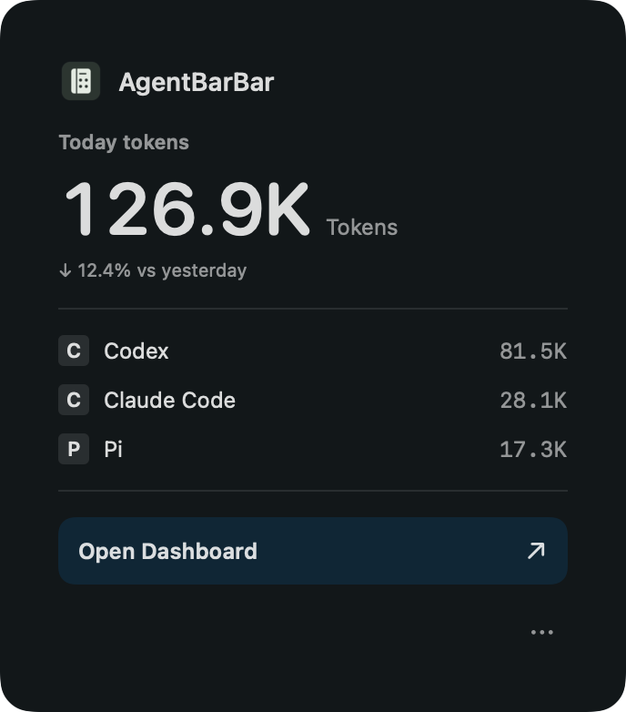
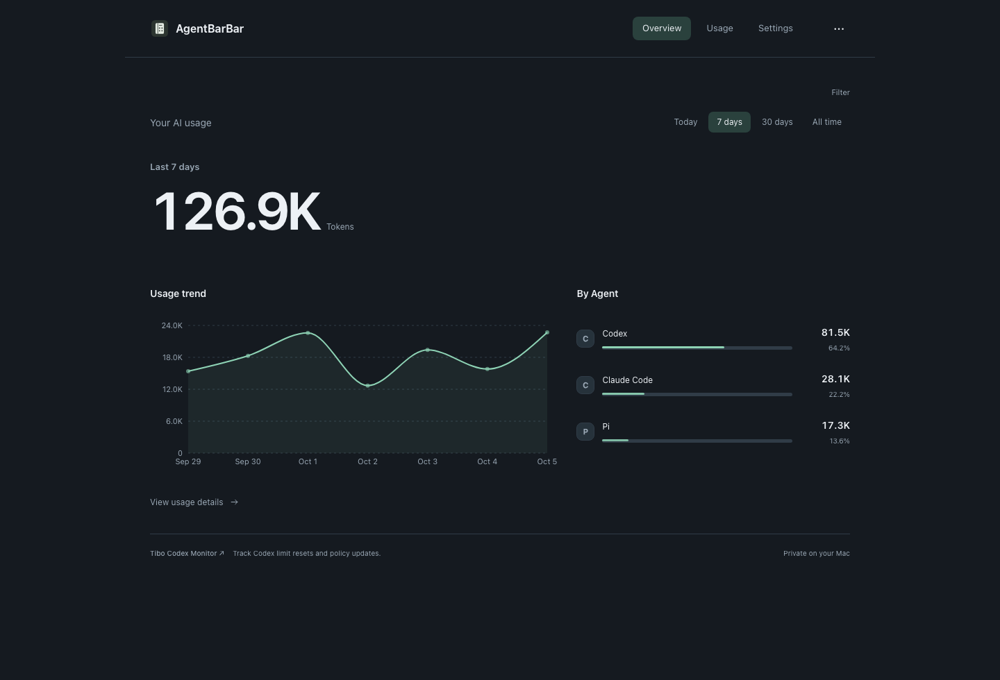
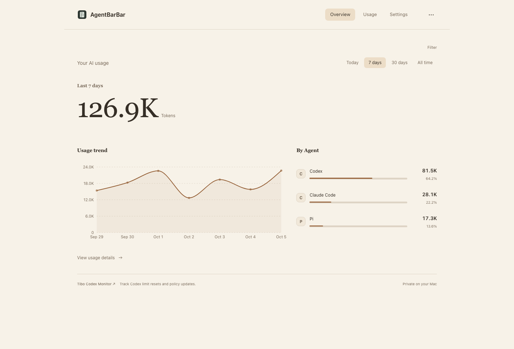
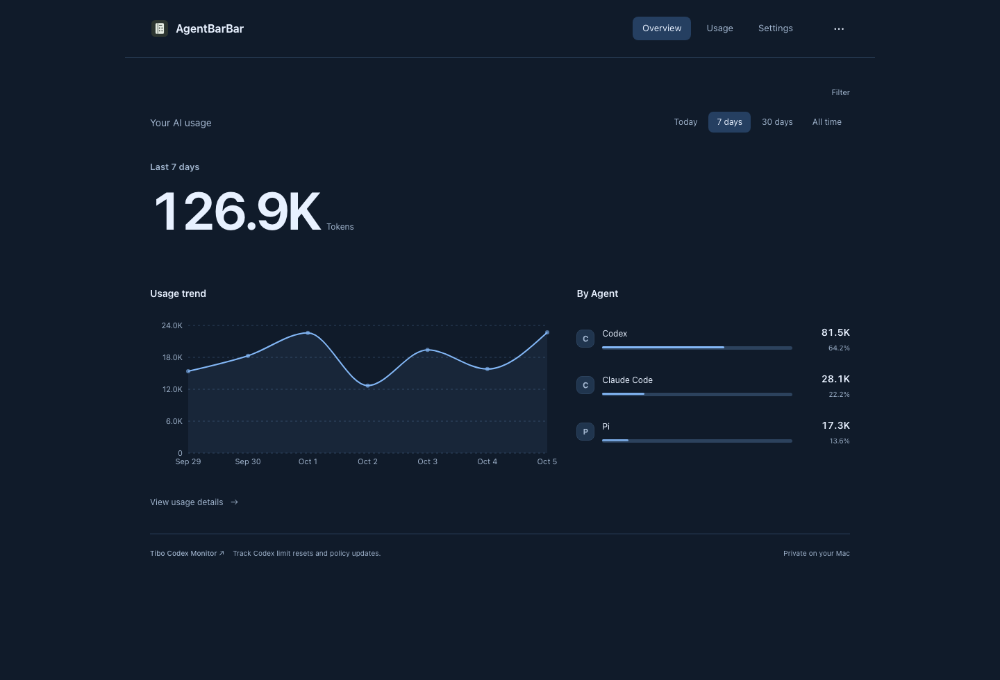
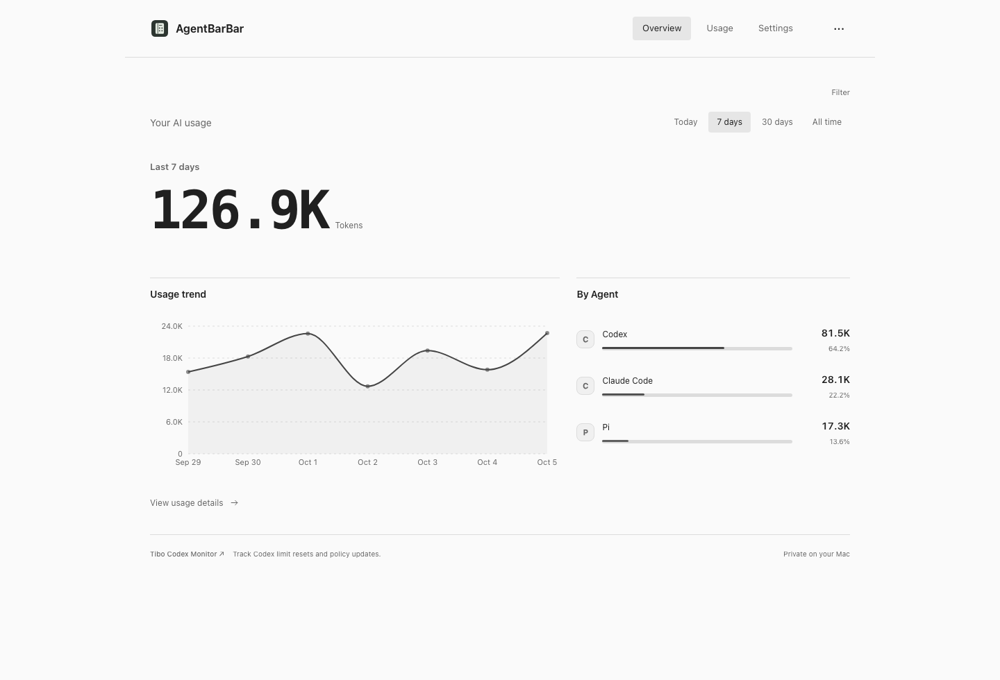
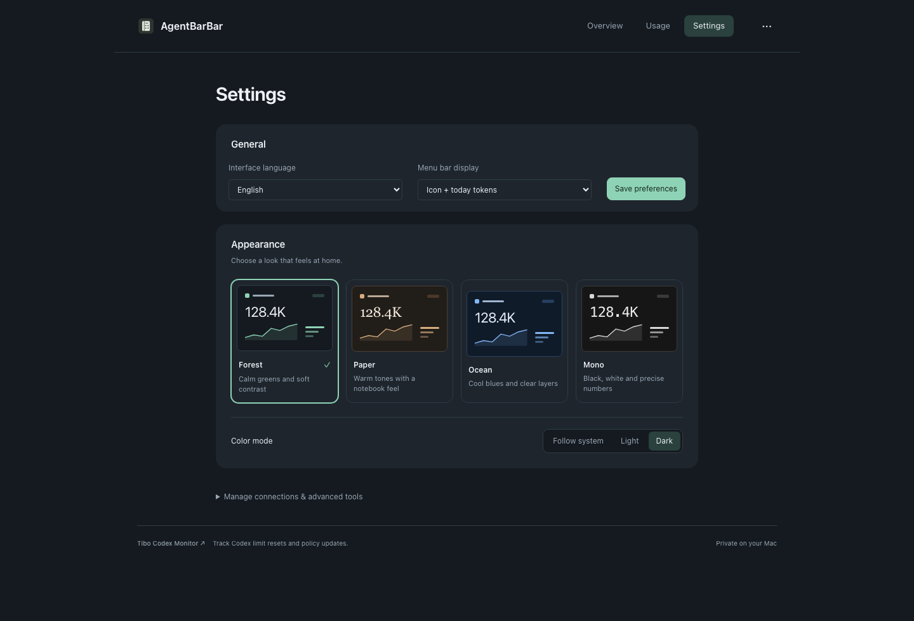
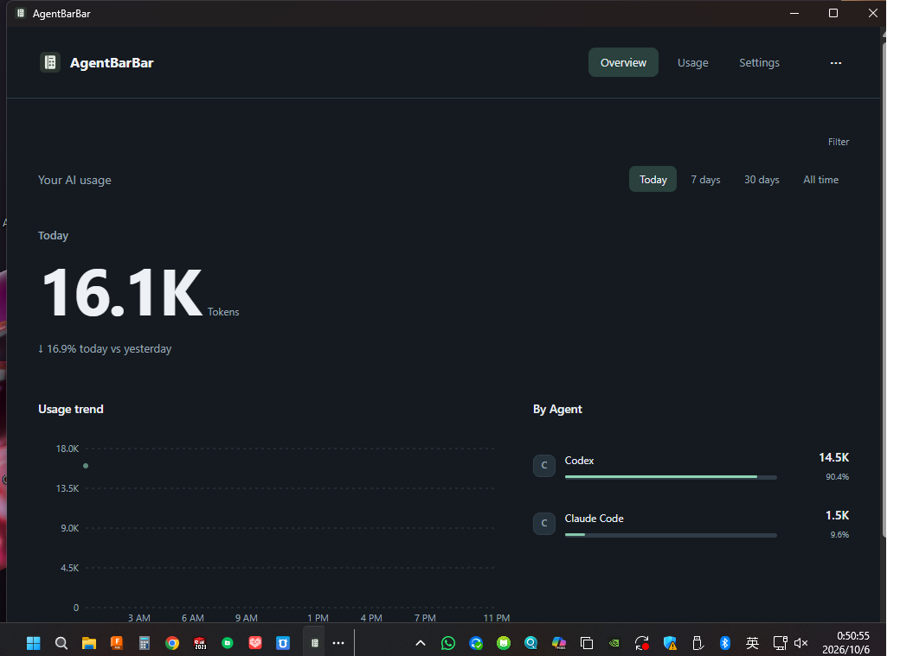
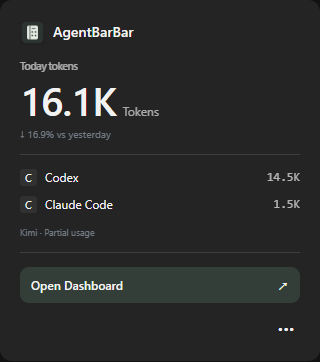

<h1 align="center">AgentBarBar</h1>

Your AI usage, at a glance.

<a href="README.zh-CN.md">简体中文</a> · <a href="README.md">English</a>

<a href="https://github.com/y2zyyr/AgentBarBar/releases/latest"><strong>Download for macOS →</strong></a> · <a href="https://github.com/y2zyyr/AgentBarBar/releases/download/v1.0.4/AgentBarBar-1.0.4-Windows-x64-Preview-Setup.exe"><strong>Windows Preview →</strong></a>

1.0.4 · Apple Silicon · macOS 14+ · 中文 / English

Demo data

Menu bar preview · Demo data

## Know what you use

AgentBarBar tracks local AI Agent usage from the macOS menu bar or Windows system tray. The Windows build is currently a preview. See today's tokens, recent trends and usage by Agent in one place.

- **A quick glance** — Today's token total in the menu bar, with your leading Agents one click away.
- **Clear trends** — Switch between today, 7 days, 30 days and all time.
- **One place** — Local usage totals, request details and exports for supported Agents.
- **Your own look** — Four themes, each with light, dark and system modes.
- **Private on your device** — No telemetry uploads or stored conversation bodies.

## Four ways to make it yours

Choose **Forest, Paper, Ocean or Mono** in **Dashboard Settings → Appearance**. Preview each style, choose light/dark or follow your system, and switch instantly. Your choice is saved automatically.

<table>
<tr>
<td width="50%" align="center"><strong>Forest · Dark</strong> </td>
<td width="50%" align="center"><strong>Paper · Light</strong> </td>
</tr>
<tr>
<td width="50%" align="center"><strong>Ocean · Dark</strong> </td>
<td width="50%" align="center"><strong>Mono · Light</strong> </td>
</tr>
</table>

Theme previews · Demo data

Settings → Appearance · Demo data

## Install on macOS

1. [Download the latest DMG](https://github.com/y2zyyr/AgentBarBar/releases/latest) and drag the app to **Applications**.
2. Open the app, then click its menu bar icon to view usage.

If macOS cannot verify the developer, try opening the app, then go to **System Settings → Privacy & Security → Open Anyway**. The current download is not notarized by Apple.

## Windows 1.0.4 Preview

[Download the Windows x64 installer](https://github.com/y2zyyr/AgentBarBar/releases/download/v1.0.4/AgentBarBar-1.0.4-Windows-x64-Preview-Setup.exe) · [Windows installation guide and limitations](WINDOWS.md)

A real system-tray app with a quick usage popup and the shared dashboard: Today, 7 days, 30 days, all time, Agent/model breakdowns and request details. Forest, Paper, Ocean and Mono; light/dark/system modes; Chinese and English.

- **Verified on Windows:** Codex and Claude Code local usage collection.
- **Partial:** Kimi CLI historical usage; live accounting is not fully verified.
- **Unverified on Windows:** the other seven Agents listed for macOS.
- **Preview status:** unsigned; long-run, sleep/wake, upgrade and final uninstall validation remain incomplete. No Windows autostart or automatic updater yet.

Tested on Windows 11 x64 with WebView2. No Rust, Node.js or development tools are required to run the installed app. Quit AgentBarBar from its tray menu before installing over an existing copy.

Actual Windows app captures from pre-packaging validation; usage totals only, no conversation content. These are not screenshots of the final rebuilt installer.

Actual 1.0.4 preview installer: Chinese and English displayed together on the same page.

## Supported Agents

On macOS, reads local usage records from Codex, Claude Code, DeepSeek Harness, WorkBuddy, Pi, Kimi CLI, Gemini CLI, OpenCode, Antigravity and Antigravity IDE.

Available metrics depend on the records an Agent provides. Missing counters remain unavailable. Importing a large history for the first time may take a few minutes.

## Updates & feedback

The macOS app checks GitHub for new versions and lets you download the installer. The DMG is saved to **Downloads** and opened; drag the app to **Applications** to replace your installed version. Automatic checks can be turned off in native settings.

The dashboard also links to [Tibo Codex Monitor](https://tibo.modelyard.dev), an independent tracker of Codex limit resets and policy updates.

- [Releases](https://github.com/y2zyyr/AgentBarBar/releases)
- [Report a bug / suggest a feature](https://github.com/y2zyyr/AgentBarBar/issues)

Please include your app version, operating-system version and Agent name. Chat logs and account credentials are not needed.

## Share AgentBarBar

[English poster](assets/poster-en.png) · [中文海报](assets/poster-zh.png)

## About this repository

This repository hosts product information and downloads. Application source code remains private. AgentBarBar is free to download and use; third-party license notices are included in the app.
