
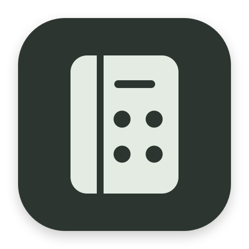

<h1 align="center">AgentBarBar</h1>

让 AI 用量一目了然。

<a href="README.zh-CN.md">简体中文</a> · <a href="README.md">English</a>

<a href="https://github.com/y2zyyr/AgentBarBar/releases/latest"><strong>下载 macOS 版 →</strong></a> · <a href="https://github.com/y2zyyr/AgentBarBar/releases/download/v1.0.4/AgentBarBar-1.0.4-Windows-x64-Setup.exe"><strong>下载 Windows 版 →</strong></a>

1.0.4 · Apple Silicon · macOS 14+ · 中文 / English

<a href="https://github.com/y2zyyr/AgentBarBar/releases/latest">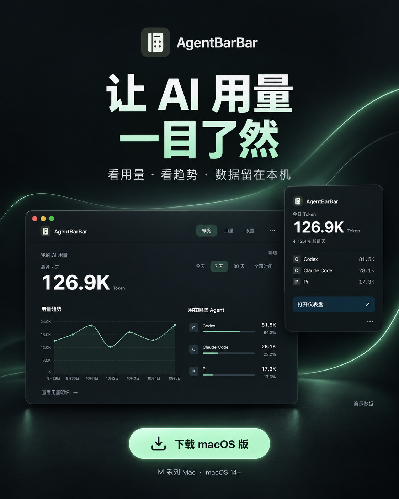</a>

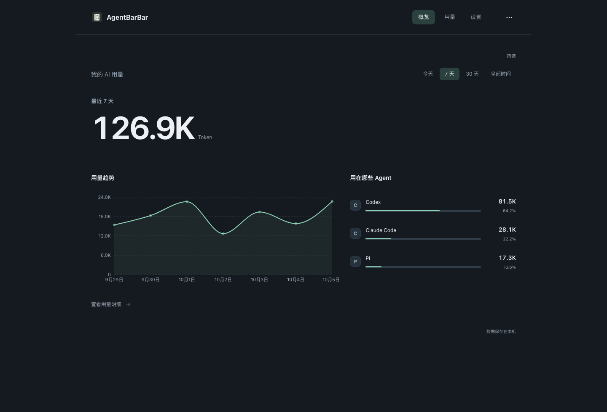

演示数据 · Demo data

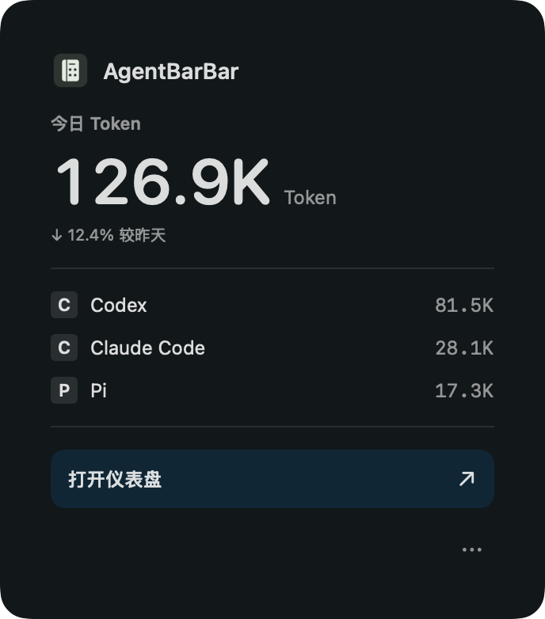

菜单栏预览 · 演示数据

## 用了多少，打开就知道

AgentBarBar 是一个本地 AI 用量工具，可从 macOS 菜单栏或 Windows 系统托盘访问。今天用了多少 Token、最近趋势如何、主要用在哪些 Agent，打开就能看到。

- **随手看用量** — 菜单栏显示今日 Token，点击查看主要 Agent。
- **看清趋势** — 切换今天、7 天、30 天和全部时间。
- **统一查看** — 汇总本机受支持 Agent 的用量，提供请求明细与导出。
- **换个喜欢的风格** — 四种主题，支持浅色、深色和跟随系统。
- **数据留在本机** — 不上传遥测，不保存对话正文。

## 四种主题，选你喜欢的

在 **Web 面板 → 设置 → 外观** 中选择 **松绿、纸感、深海或极简**。预览风格，选择浅色、深色或跟随系统，点击即可切换并自动保存。

<table>
<tr>
<td width="50%" align="center"><strong>松绿 · 深色</strong> <a href="assets/theme-forest-zh.png">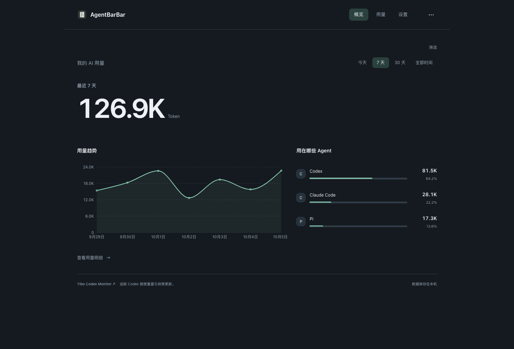</a></td>
<td width="50%" align="center"><strong>纸感 · 浅色</strong> <a href="assets/theme-paper-zh.png">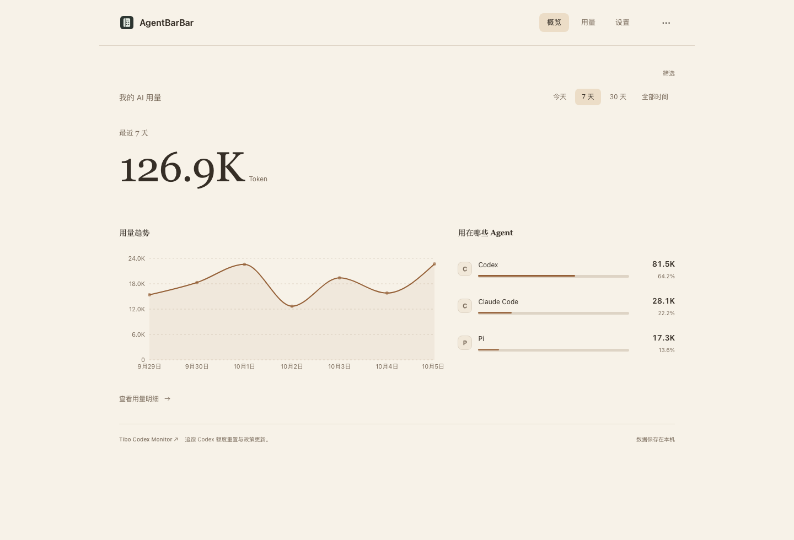</a></td>
</tr>
<tr>
<td width="50%" align="center"><strong>深海 · 深色</strong> <a href="assets/theme-ocean-zh.png">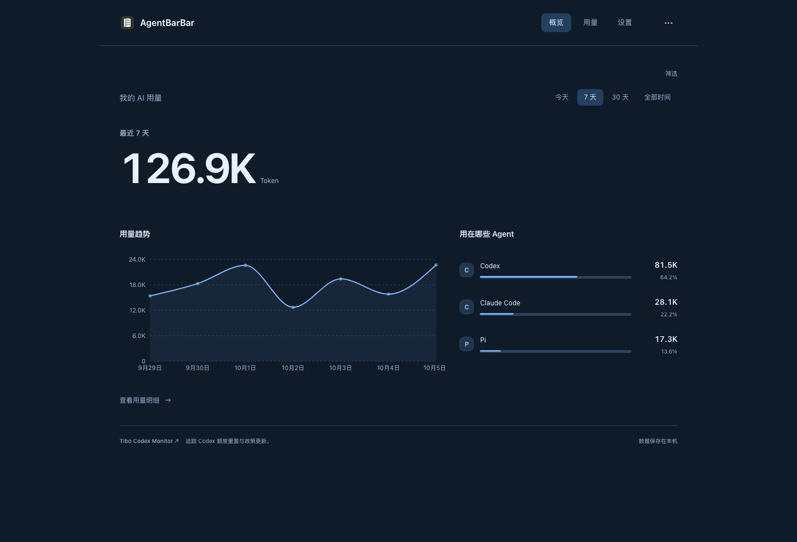</a></td>
<td width="50%" align="center"><strong>极简 · 浅色</strong> <a href="assets/theme-mono-zh.png">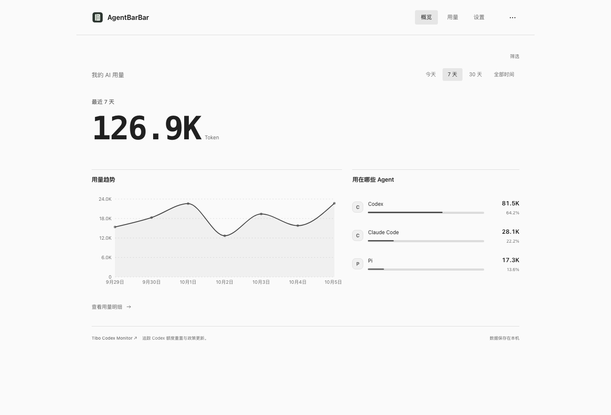</a></td>
</tr>
</table>

主题预览 · 演示数据

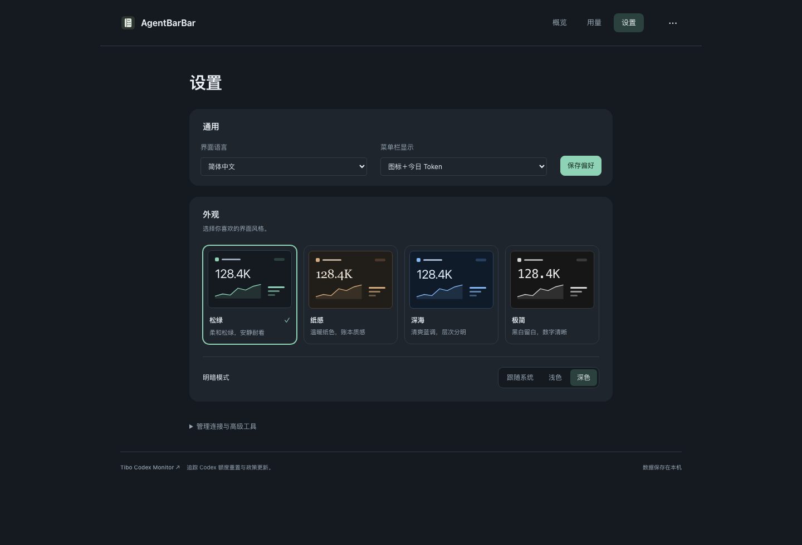

设置 → 外观 · 演示数据

## macOS 安装

1. [下载最新 DMG](https://github.com/y2zyyr/AgentBarBar/releases/latest)，将 App 拖到 **Applications 应用程序**。
2. 打开 App，点击菜单栏图标即可查看用量。

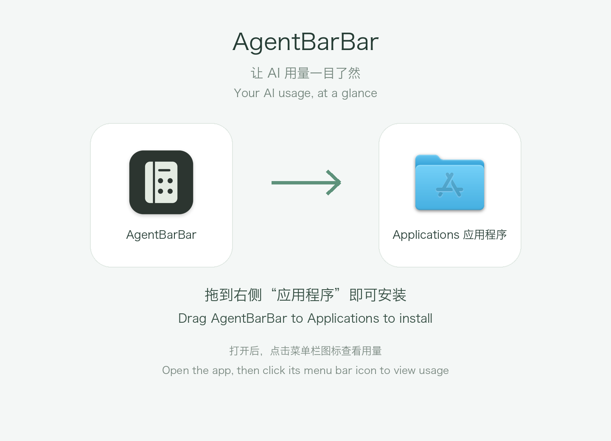

若 macOS 提示无法验证开发者：尝试打开后，进入 **系统设置 → 隐私与安全性 → 仍要打开**。当前下载包未经过 Apple 公证。

## Windows 1.0.4

[下载 Windows x64 EXE 安装包](https://github.com/y2zyyr/AgentBarBar/releases/download/v1.0.4/AgentBarBar-1.0.4-Windows-x64-Setup.exe) · [Windows 安装说明与已知限制](WINDOWS.zh-CN.md)

真正运行在系统托盘的桌面应用：点击查看用量 Popup，再打开共享仪表盘。支持今天、7 天、30 天、全部时间、Agent / 模型统计和请求明细；保留松绿、纸感、深海、极简四主题，浅色 / 深色 / 跟随系统，以及中文 / English。

- **已接入十个采集器：** Codex、Claude Code、Kimi CLI、DeepSeek Harness、WorkBuddy、Pi、Gemini CLI、OpenCode、Antigravity 和 Antigravity IDE。
- **Windows 真实数据验证：** Codex、Claude Code、Kimi 历史记录和 DSH。DSH 读取自己的 SQLite 用量账本，校验汇总，重复同步不会重复计数。
- **样本验证：** 十个采集器的请求身份、Token 数值及缺失字段状态与 macOS 参考一致。验证机器上没有可用记录的 Agent 尚未完成真实数据源系统验证。
- **自动勘测：** 查找候选 Token 字段、采集所选 Agent 并保存报告；重载后仍能查看。历史覆盖显示已保存的记录数和日期，重复同步不会误显示为 0。
- **同步提示修复：** 任务结束后显示“同步已完成”，没有新增记录的同步也会正确结束。
- **安装：** 每一页同时显示中英文。安装包未签名，暂不提供 Windows 自动启动和自动更新。

已在 Windows 11 x64 + WebView2 测试。安装后的应用运行不需要 Rust、Node.js 或开发工具。覆盖安装前，请先从托盘菜单退出 AgentBarBar。

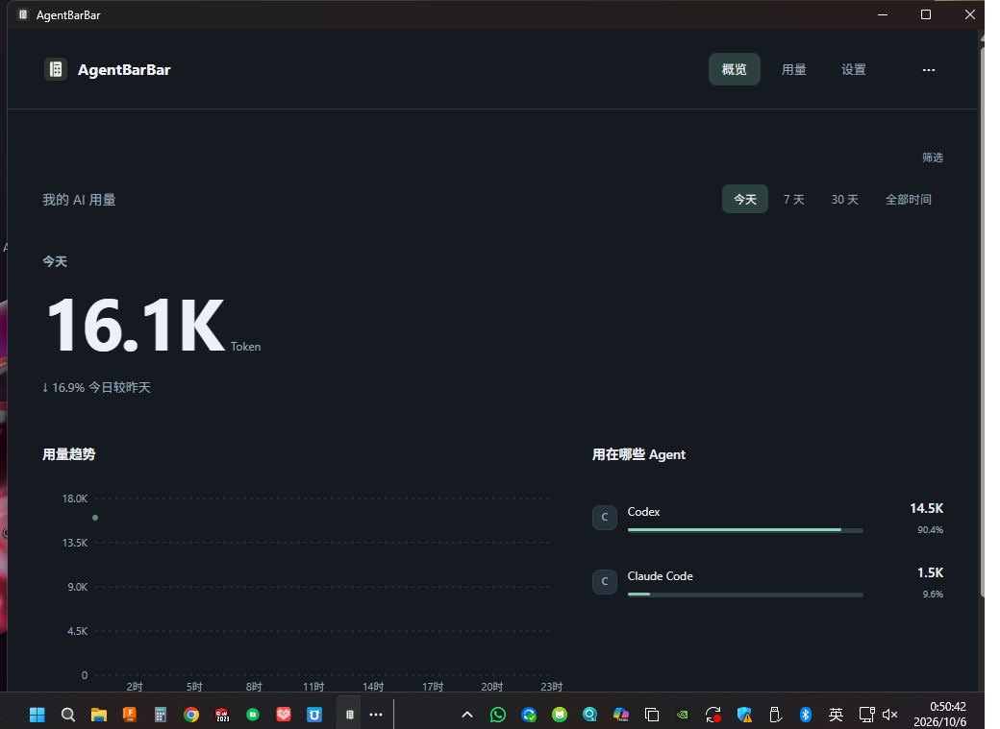

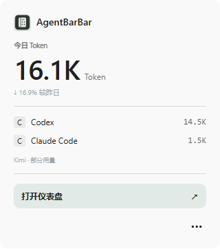

打包前验证时的真实 Windows 应用截图，仅展示用量统计，不含对话正文；不是最终重打包安装包的截图。

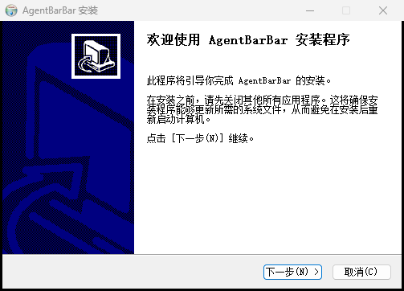

此前 1.0.4 安装包的真实双语界面截图；更新后的安装包保留此布局。

## 支持哪些 Agent？

macOS 和 Windows 支持读取 Codex、Claude Code、DeepSeek Harness、WorkBuddy、Pi、Kimi CLI、Gemini CLI、OpenCode、Antigravity 和 Antigravity IDE 的本机用量记录。

实际可显示的分项取决于 Agent 提供的记录；已有记录但缺少计数时，会显示为不可用。首次读取较多历史记录可能需要几分钟。

## 更新与反馈

macOS App 会从 GitHub 检查新版本，发现更新后提示下载。安装包保存到 **“下载”文件夹** 并打开，将 App 拖入 **“应用程序”** 即可自行覆盖安装。可在原生设置中关闭自动检查。

仪表盘底部提供 [Tibo Codex Monitor](https://tibo.modelyard.dev) 入口，查看 Codex 额度重置与政策更新；该网站是独立监测站点。

- [版本更新](https://github.com/y2zyyr/AgentBarBar/releases)
- [报告问题 / 建议功能](https://github.com/y2zyyr/AgentBarBar/issues)

反馈时请说明应用版本、操作系统版本和使用的 Agent；无需提供聊天记录或账号凭证。

## 推广海报

[中文海报](assets/poster-zh.png) · [English poster](assets/poster-en.png)

## 关于这个仓库

本仓库提供产品介绍和安装包，应用源码保持私有。AgentBarBar 可免费下载使用；随包附有第三方依赖许可声明。
